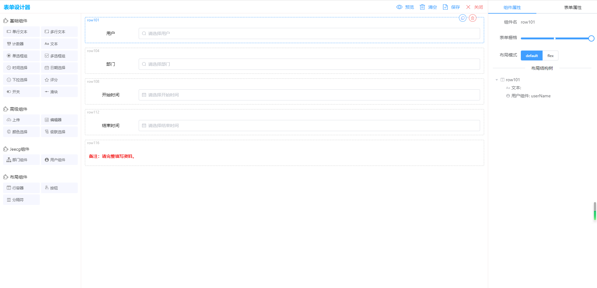
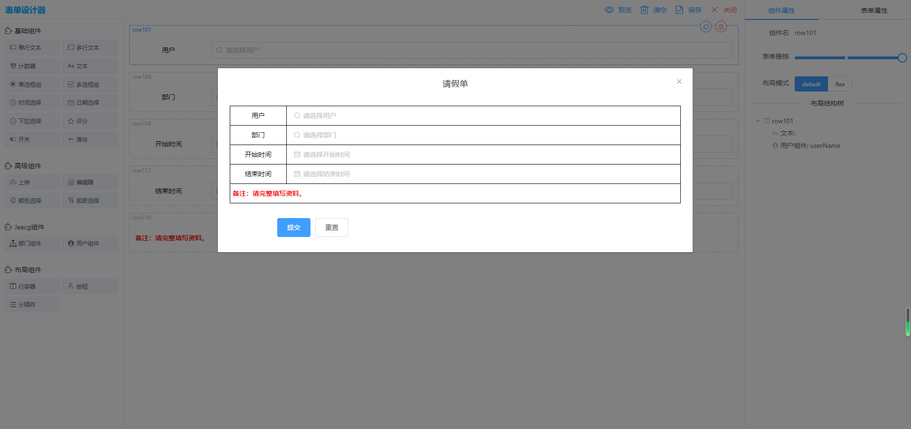
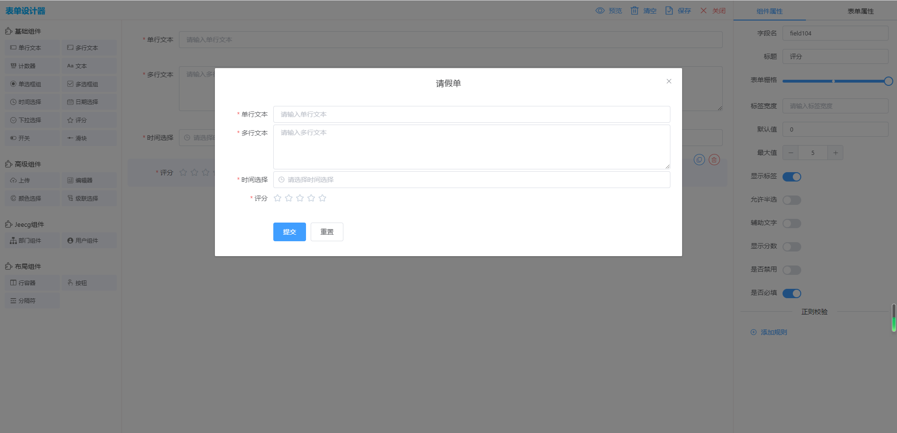

# form-generator-jeecgboot

#### 项目描述
基于vue2.x、elementUI、form-generator 仿jeecg-boot的表单设计器。

运行示例地址：[https://lemnaminor.github.io/form-generator-jeecgboot/dist](https://lemnaminor.github.io/form-generator-jeecgboot/dist "https://lemnaminor.github.io/form-generator-jeecgboot/dist")

项目示例图片：



表单设计器组件组件调用示例：
```js
import formGenerator from '@/components/formGenerator/views/index/Home.vue'
```
```html
<form-generator
  ref="formGenerator"
  @onClose="visibleGen = false"
  @onSave="onSaveFinish"
  :formJson="formJson_1"
/>
```
表单解释器组件调用示例：
```js
import Parser from '@/components/formGenerator/components/parser/Parser'
```
```html
<parser
  :form-conf="formJson"
  @submit="onSubmit"
/>
```

#### 项目说明：
1，本项目因结合公司流程图业务使用，注释了form-generator运行、预览json、导出代码等功能。

2，本项目在form-generator的基础上进行二次开发，添加了文本、分隔符、用户组件、部门组件等4个组件。

3，因业务需求扩展了parser解释器组件，表单保存传参时把对应字段属性递归绑定到了表单json属性字段里面。用户组件、部门组件默认添加了`'${属性名}Id'`字段以方便后端查询使用。

4，因业务需求对单行文本组件、用户组件、部门组件等3个组件添加了'隐藏字段'属性面板。勾选后解释器不显示对应组件。

5，修改了行容器布局样式使表单接近表格形式，结合文本组件使用更佳。不使用行容器布局则是正常element表单形式。如下图：






#### 参考链接（感谢）：
form-generator: [https://github.com/JakHuang/form-generator](https://github.com/JakHuang/form-generator "https://github.com/JakHuang/form-generator")

element-ui: [https://element.eleme.cn//#/zh-CN/component/installation](https://element.eleme.cn//#/zh-CN/component/installation "https://element.eleme.cn//#/zh-CN/component/installation")

#### 引入项目说明

##### 项目文件夹：/src/components/formGenerator

##### package.json
```json
  "dependencies": {
    "clipboard": "^2.0.4",
    "element-ui": "^2.13.2",
    "file-saver": "^2.0.5",
    "throttle-debounce": "^3.0.1",
    "vuedraggable": "^2.23.2"
  },
  "devDependencies": {
    "node-sass": "^4.12.0",
    "sass-loader": "^8.0.2",
    "svg-sprite-loader": "^4.1.6",
  }
```

##### 配置 vue.config.js
添加以下代码以使用svg-sprite-loader插件让svg图标显示。
```js
const path = require('path')

function resolve(dir) {
  return path.join(__dirname, dir)
}

module.exports = {
  // ...其他配置
  chainWebpack(config) {
    // set svg-sprite-loader
    config.module
      .rule('svg')
      .exclude.add(resolve('src/components/formGenerator/icons'))
      .end()
    config.module
      .rule('icons')
      .test(/\.svg$/)
      .include.add(resolve('src/components/formGenerator/icons'))
      .end()
      .use('svg-sprite-loader')
      .loader('svg-sprite-loader')
      .options({
        symbolId: 'icon-[name]',
      })
      .end()
  },
}
```

##### main.js

```js
// formGenerator
import ElementUI from 'element-ui';
import 'element-ui/lib/theme-chalk/index.css';
Vue.use(ElementUI);

import '@/components/formGenerator/styles/index.scss'
import '@/components/formGenerator/icons'
import Tinymce from '@/components/formGenerator/components/tinymce/index.vue'
import JText from '@/components/formGenerator/components/JComp/JText/JText.vue'
import JSelectDept from '@/components/formGenerator/components/JComp/JSelectDept/JSelectDept.vue'
import JSelectUser from '@/components/formGenerator/components/JComp/JSelectUser/JSelectUser.vue'

Vue.component('tinymce', Tinymce)
Vue.component('JText', JText)
Vue.component('JSelectDept', JSelectDept)
Vue.component('JSelectUser', JSelectUser)
```

#### 项目运行
1，项目下载依赖
```
npm install 或者 cnpm install
```
2，项目运行
```
npm run serve
```
3，项目打包
```
npm run build
```

### 其他说明
1，如此项目对你有所帮助我很开心，请点一下star以帮助到更多的人。

2，如项目有问题请提issues，或者联系我本人QQ：291294950。